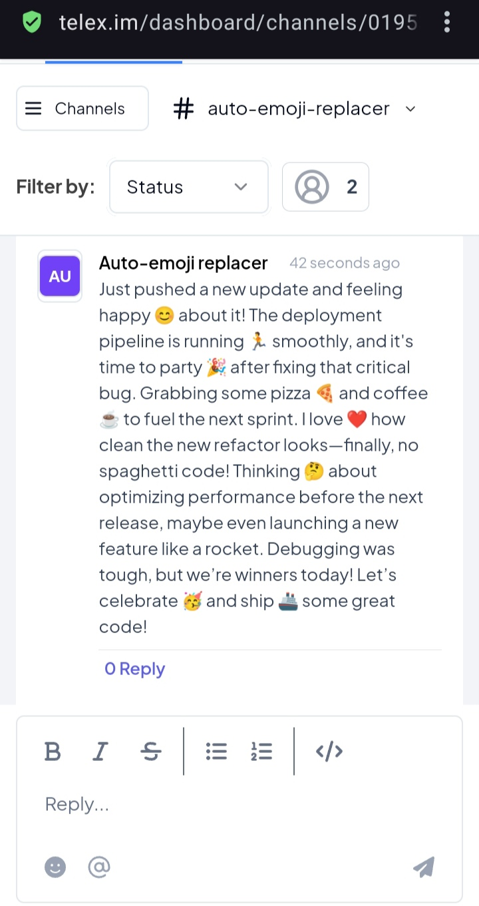

# **Auto-Emoji Replacer - Telex Integration**  

## **📌 Overview**  
The **Auto-Emoji Replacer** is a **Modifier Integration** for **Telex**, automatically replacing specific words in messages with corresponding emojis. This enhances user communication by providing a dynamic emoji replacement system.  

## **🚀 Features**  
- Replaces predefined words with emojis in messages.  
- Works as a **Modifier Integration**, modifying messages before they appear in a channel.  
- Easy to configure and extend with additional emoji mappings.  

## **🛠️ Setup Instructions**  

### **1️⃣ Clone the Repository**  
```sh
git clone https://github.com/telexorg/auto-emoji-replacer.git
cd auto-emoji-replacer
```

### **2️⃣ Install Dependencies**  
```sh
npm install
```

### **3️⃣ Start the Server**  
```sh
npm start
```
By default, the server runs on `http://localhost:3000`.

## **🧪 Testing the Integration**  

### **Test API Locally** (Using cURL or Postman)  
Send a POST request to test emoji replacement:  
```sh
curl -X POST http://localhost:3000/process-message -H "Content-Type: application/json" -d '{"message": "I am happy"}'
```
**Expected Response:**  
```json
{
  "Message": "I am happy 😊"
}
```

## **📝 Telex Integration Configuration**  

### **1️⃣ Define the Integration JSON**  
Create an `integration-spec.json` file:  


### **2️⃣ Host the Integration JSON**  
- The `integration.json` was hosted to a publicly accessible server.  
- The url is `https://auto-emoji-replacer.onrender.com/integration-spec`. 

## **📸 Screenshots**  

### **✅ Local Testing (Postman Response)**  
 


### **✅ Telex Integration Test**  
  

## **✅ Submission Checklist**  
✔ Hosted **integration-spec.json** file   
✔ Working **Telex Integration**  
✔ Updated **README** with screenshots  
